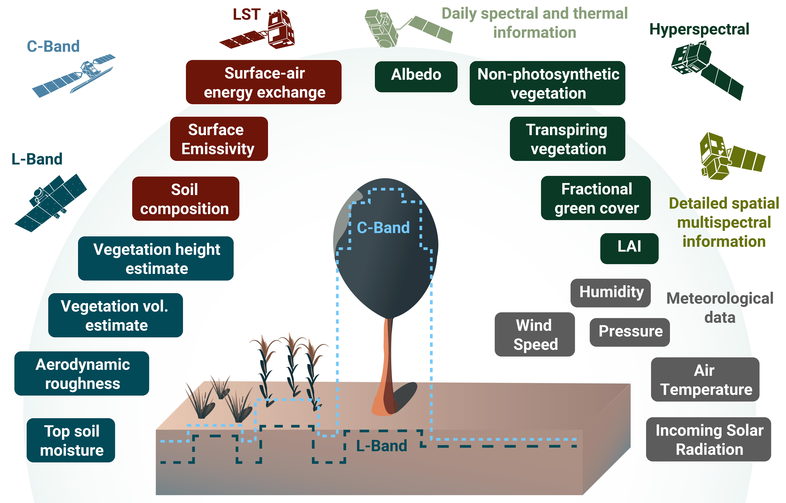
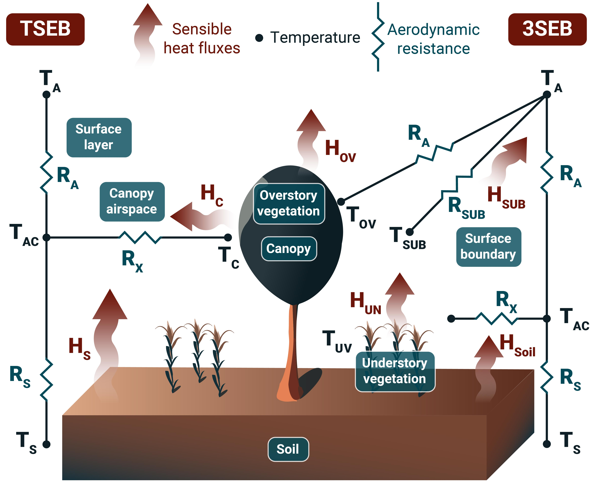

# Activities

The MULTIWATER project will consist of the following activities:
- Input data collection and pre-processing
- Data fusion
- Actual evapotranspiration modelling using TSEB/3SEB
- Production of outputs

## Input data collection and pre-processing
The primary input data for MULTIWATER are derived from the Representative Dataset missions, which are highly complementary in spatial resolution, revisit frequency and radiometric resolution.

*TSEB/3SEB model input from multi-sensor approach. The existing Copernicus Sentinel-1/2/3 and Expansion Missions indicate the full potential when CHIME, LSTM and ROSE-L are in operation. Penetration of the electromagnetic wave in the soil and vegetation (grass, crop, trees) as a function of frequency band (C in light blue and L in dark blue). Ancillary data include meteorological data.*

**Hyperspectral data and biophysical traits**

Level 2 Bottom of the Atmosphere (BOA) reflectance products will be considered as primary for each representative mission. The radiometric quality of these products will be benchmarked against Sentinel-2 L2A BOA products and in situ measured hyperspectral data. From the BOA reflectances and its ancillary data (i.e. water vapour, aerosol optical thickness, acquisition geometry), biophysical traits will be derived and used in higher level products.

**Land Surface Temperature** 

The Land Surface Temperature and Emissivity (LSTE) product is a standard level 2 product of the ECOSTRESS mission. The product is calculated using the Temperature-Emissivity-Separation algorithm developed by Gillespie et al. and adapted to ECOSTRESS by Hulley et al. ECOSTRESS images are originally acquired at 38 m x 69 m spatial resolution, and are resampled to 0.006 degrees (approximately 70 m x 70 m). The LST products are derived from ECOSTRESS’ 5 spectral bands at 8.28 μm, 8.63 μm, 9.07 μm, 10.6 μm, and 12.05 μm (although for some datasets only 3 spectral bands are available). Each dataset contains quality assurance flags, including a cloud contamination flag and LST accuracy, which can be used for automated masking procedures. The data needs to be assessed in terms of georeferencing accuracy, and clouds and radiometry errors need to be masked in pre-processing.

**L-Band SAR data**

In order to preserve the full information brought by quad-polarimetric data, we intend to work on the polarimetric matrix, which includes all backscatter amplitudes (on the HH, HV and VV channels) and the complex covariance between channels. For this purpose, the level 1.1 data (Single Look Complex), which is a standard JAXA product, is used. It needs to be calibrated, thermal noise corrected, orthorectified and radiometrically terrain-corrected, making it compliant with analysis-ready data. Additionally, the influence of the polarization orientation angle will be evaluated and corrected for. Alternatively, the direct use of level 2.1 data, which is already orthorectified but only contains amplitude backscatters can also be considered if the complex covariance between channels does not bring substantial additional value.

**Additional data**

Ancillary data required for higher level products (ET, water stress, etc.) includes meteorological forcing, land cover maps and canopy height [4]. ERA5 reanalysis will be obtained from the Copernicus Climate Data Store, and CAMS reanalysis from the Copernicus Atmosphere Data Store. Copernicus Land Cover maps will be used to characterise some canopy properties that are difficult to quantify with Earth Observation. Finally, forest canopy height data will be retrieved from GEDI products.

## Data fusion
The integration and data fusion between different Earth Observation sensors is of utmost importance in order to obtain products with relevant temporal, spatial and spectral characteristics to adequately support agricultural monitoring, forest and natural hazard management, biodiversity and ecosystem mapping and assessments. We plan to utilise the ECOSTRESS/Landsat/ASTER and PRISMA/EnMAP/DESIS products in synergy and ALOS-2/SAOCOM complementary with Sentinel observations, in order to produce continuous time series of daily ET
and biophysical traits. Daily ET at high spatial resolution (i.e. field scale <100m) is most useful to support irrigation scheduling, monitor water rights compliance and water accounting. Data fusion allows us to meet this requirement by increasing spatio-temporal resolutions.

Data fusion will be attempted both among and across shortwave-optical and thermal-infrared sensors. I.e. ECOSTRESS will be used together with Sentinel-3 SLSTR and PRISMA with Sentinel-2 MSI to increase temporal resolution of the former sensors, and ECOSTRESS and Sentinel-3 will be used with PRISMA and Sentinel-2 to increase the spatial resolution of the thermal data. Thermal and optical observations from Landsat-8 and Landsat-9 satellites will be used as an independent comparison dataset. The lessons learned, such as the impact of the time of observation on the accuracy of fused thermal data and the feasibility of fusing products at different processing levels (e.g. top-of-canopy reflectance or leaf area index), will be directly applicable to future synergetic use of Copernicus candidate missions LSTM and CHIME with existing Sentinel-2 and Sentinel-3 satellites.

## Actual evapotranspiration modelling

*TSEB/3SEB model at the core of MULTIWATER information products output production*

The proposed prototype will make use of the two-source energy balance (TSEB) model building on the legacy of SEN-ET and ET4FAO, where its robustness has been demonstrated over a variety of conditions, while outperforming other state-of-the-art ET models. TSEB provides a good balance between being physically-based while requiring relatively few inputs and parameters. TSEB partitions the land surface into two distinct sources, soil and overstory vegetation, while 3SEB adds a third source namely understory vegetation (including litter and dead leaves). Depending on the land cover type, 3SEB will be applied to savannas, vineyards and orchards while TSEB will apply to the rest of the vegetated lands.

TSEB has the practical advantage of an already established open-source Python code implementation (pyTSEB, https://github.com/hectornieto/pyTSEB) to run TSEB independently or to easily integrate it within other pipelines. This presents important advantages: Python is the main scripting language in most GIS and remote sensing software (e.g., GRASS, QGIS, SNAP) and relatively easy to read and learn, yet powerful with numerous high performance libraries. Software and algorithms written in Python are truly transparent and open-source, and the source code is widely accessible to a large and growing community. Thus the R&D results from this project will be more transferable for other stakeholders, such as the private sector. pyTSEB has also been integrated with a graphical user interface based on Jupyter Notebooks, making it accessible for dissemination purposes and to end-users with limited programming skills. On top of that, pyTSEB contains very flexible and adaptable modules, constantly maintained and updated by AECSIC and colleagues from other institutions. This is important due to the very broad range of conditions and landscapes, where modelling environments should be easily adaptable to accommodate different sub-processes, including those that are specific to Mediterranean environments. For example, this may include adapting sub-modules to consider how complex canopy structure affects the wind attenuation through the canopy [35], which affects aerodynamic conditions promoting ET or even the physiological response of crops to changing soil and atmospheric conditions.

One of the main input required by TSEB is land surface temperature (LST) derived from thermal infrared (TIR) sensors. The ECOSTRESS mission provides highly valuable TIR data acquisitions with an average 4-day revisit time and sampling at 70m spatial resolution. Furthermore, due to its unique orbit on the International Space Station (ISS), its overpass time occurs at different times of the day, giving us the opportunity to investigate the effect of acquisition time on ET modelling, especially for the upscaling of instantaneous fluxes to daily estimates.

The retrieval of plant biophysical traits, such as leaf area index, is the other main set of inputs needed for TSEB modelling. These are normally derived from optical visible and near-infrared (VNIR) sensors. For example in Sen-ET, the Sentinel-2 multispectral bands were used to retrieve these biophysical traits via radiative transfer modelling (RTM) inversion. With the new PRISMA and EnMAP missions, we have the opportunity to exploit hyperspectral data acquisitions at 30m to improve biophysical traits estimation. Particularly, these data could prove useful to separate green and non-photosynthetically active (i.e. senescent) vegetation biomass. This research line is relatively new and growing, appreciating that non-photosynthetic vegetation (e.g. dead vegetation or litter) play an important role in energy, water, carbon and nutrient cycling. ROSE-L can penetrate deeper into the canopy, and has the capability to interact with the understory vegetation and the soil layer, thus providing valuable inputs for both TSEB and 3SEB models. For TSEB and 3SEB models, ROSE-L can also penetrate the top layer of the soil and measure soil moisture, which is crucial for calculating soil heat flux and soil-related energy balance components. By interacting with overstory vegetation, ROSE-L can measure vegetation structure, biomass, and water content, thus enhancing the estimation of canopy latent and sensible heat fluxes. Additionally, ROSE-L’s penetration ability into understory vegetation can directly support the third source in 3SEB. Though not measuring temperature directly, ROSE-L can enhance the estimation of LST by providing complementary information on vegetation structures, water content, soil moisture, and surface roughness. Vegetation structure and water content affect the canopy’s temperature, while topsoil moisture has a direct influence on soil temperature since wet soil tends to have a lower temperature than dry soil due to the cooling effect of evaporation. Therefore, ROSE-L’s advanced radar technology provides essential data that significantly enhance the inputs for both TSEB and 3SEB models, enabling more accurate modelling and outputs for better understanding and predicting environmental processes.

## Production of outputs

*MULTIWATER information products specification from the demonstrator application infrastructure when Copernicus Expansion Missions CHIME, LSTM and ROSE-L are in operation*

**ET and its partitioning into evaporation and transpiration**

ET and its partitioning into soil evaporation and plant transpiration will be the pivotal higher level output in MULTIWATER. ET will be derived either with TSEB or 3SEB, with the latter applied on tree-grass ecosystems and woody crops with a herbaceous layer, and the former for the rest of the land cover types. ET is critical to the Water Basin Authorities (CHS, AIPo), as key input to their hydrological models. Furthermore, ET is linked to most of the other higher-level outputs, such as water stress, yield, or irrigation accounting

**Water stress**

Based on TSEB/3SEB outputs, several water stress metrics will be computed as the ratio of actual ET over potential ET, the ratio of actual T over potential T, and the ratio of actual stomata conductance over maximum stomatal conductance, among others, see Nieto et al. for more details and additional metrics and their significance for water stress monitoring. These stress metrics are useful for fire ignition and fire spread behaviour (FDO, JRC-EFFIS), as well as to evaluate/mitigate drought events by Water Basin Authorities (CHS, AIPo) and crop insurance policies (SGCHERBA).

**Biomass and crop yield estimate**

Crop growth and yield estimates are key indicators for food security assessments. Improving yield estimations through remote sensing, combined with ET maps, would provide vital information for farmers and regional managers to monitor, mitigate and plan for the effects of prolonged droughts on food production. We will estimate annual grain yield for arable lands by means of time-series analysis of EO biophysical products and ET-based crop stress metrics. In order to complement the yield data provided by our Champion Users (e.g. SGCHERBA), additional simulations using crop models will be created to establish an in-silico database of crop yield vs. crop growth metrics. These simulations will consider all plausible variability of soil, climate and agronomic practices encountered in the study sites. Then, time series of biophysical products (e.g. PV and NPV LAI, chlorophyll/Nitrogen) together with ET-based crop stress and water use would be temporally integrated (e.g. peak value, time of the peak value, growing season length, etc.) to characterize the crop growth development. Finally, data-driven crop yield models for the main herbaceous crop types of interest will be calibrated with the in-situ and in-silico yield data. This proposed approach, similar to the one described in Lobell et al. [32] is analogous to the one used by the SNAP biophysical processor, in which a simulated database is used to generalize a data-driven model to estimate the objective variable (yield in this case, LAI and fAPAR in case of the S2ToolBox Level 2 products).

**Water Use Efficiency**

Water use efficiency will be expressed in MULTIWATER as the ratio of crop yield over annual ET, and is a useful metric to evaluate the effectiveness of water endowments assigned by the Water Basis Authorities (CHS, AIPo) to their respective agricultural demand units and irrigation perimeters.

**Irrigation**

A monitoring program of water use within irrigation schemes consists of two main components: irrigation scheme delimitation and accounting for water use within the schemes. The delimitation is particularly important in remote areas where water licensing programmes are operating, since the licensing databases might not cover all the irrigation perimeters owing to either accidental or deliberate omissions. Therefore, it cannot be ruled out that irrigation perimeters not included in the database are operating illegally and thus not accounted for when governments design and execute water management plans.

Water use accounting is equally important for licensing and national water management but it can also serve the purpose of improving water use efficiency and water utilization within each irrigated area. Time series of high spatio-temporal resolution evapotranspiration and biophysical maps are critical for both delimitation and water-use accounting. Irrigation schemes show different temporal patterns of both phenology and evapotranspiration compared to surrounding natural vegetation and rain-fed croplands. These distinctions can be used within classification and machine-learning models to separate irrigated and non-irrigated vegetation. Irrigation accounting in MULTIWATER will be evaluated by combining prognostic soil water balance (SWB) models and a diagnostic of ET and topsoil moisture to estimate the net irrigation. However, SWB models are complex to calibrate as they require information about soil properties which are often neglected or assumed, and driving forces that are not easily routinely quantified, such as the irrigation input itself. We thus aim to develop an innovative methodology to calibrate the SWB model during rainfed seasons. The calibration will be used in order to characterize the physical soil properties and then apply the rainfed-driven SWB as a baseline model during the irrigation season.

