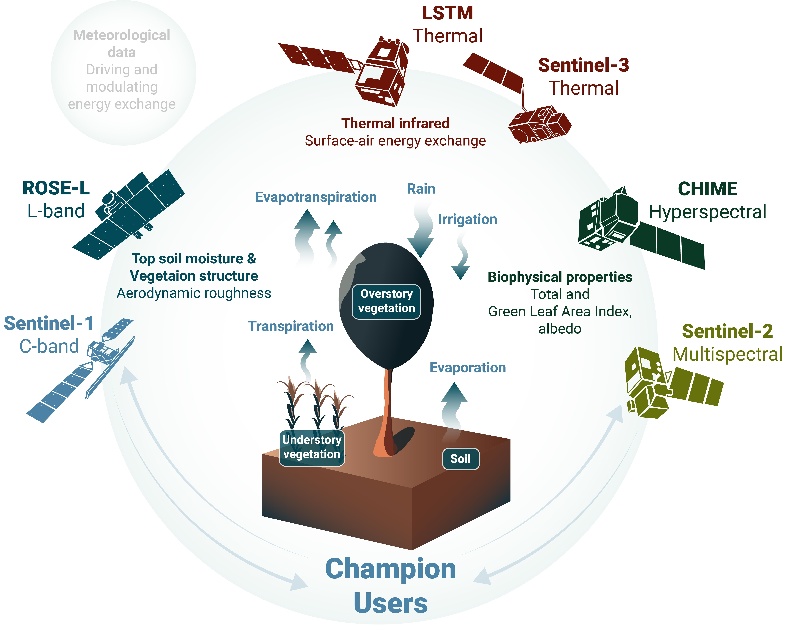

The primary objective of MULTIWATER (**MULTI**-sensor **WAT**er resource management and Sentinel Expansion missions **E**nd-user **R**eadiness) project, an **ESA Sentinel User Preparation (SUP)** initiative, is to develop the necessary Representative Datasets of the Sentinel Expansion Missions and use them to implement and showcase how these datasets will provide future EO information products for specific Champion User communities. Specifically, the project aim to utilise the unique multi-sensor spatial, spectral and temporal characteristics of thermal sensors (such as ECOSTRESS or Landsat TIRS), experimental hyperspectral imagers (PRISMA, EnMAP, DESIS, and EMIT), the operational SAR sensor PALSAR-2, and operational Sentinel missions (Sentinel-1/2/3) to develop novel methods addressing the growing challenges affecting the nexus of water resource management and food security in the Mediterranean and beyond (Figure 2).

The ultimate aim of the MULTIWATER activity is to close current knowledge and information gaps on the agricultural and forest water use by making a step change toward water resource monitoring at high resolution and laying the groundwork for an operational monitoring system. The core of the MULTIWATER activity is to develop and implement a prototype for an EO-based water management information product suite at a flexible scale in the Mediterranean region. We will utilise the full potential of the enhanced observation capacity of the Expansion Missions in concert with the current Sentinel missions (supported by complementary missions and ancillary data where relevant and justified).

The Mediterranean region is highly susceptible to the impacts of climate change and faces several crises that could benefit from water resource management information products. Therefore, the team has chosen this region as the area of interest and secured key stakeholders capable of handling EO products as Champion Users for this project.

*High-level conceptualisation and main motivation of the derived water resource information products from the Sentinel Expansion Missions*

### Table Of Contents
- [The Project](project.html)
- [Activitites](activities.html)
- [The Team](team.html)
- [Results](results.html)
