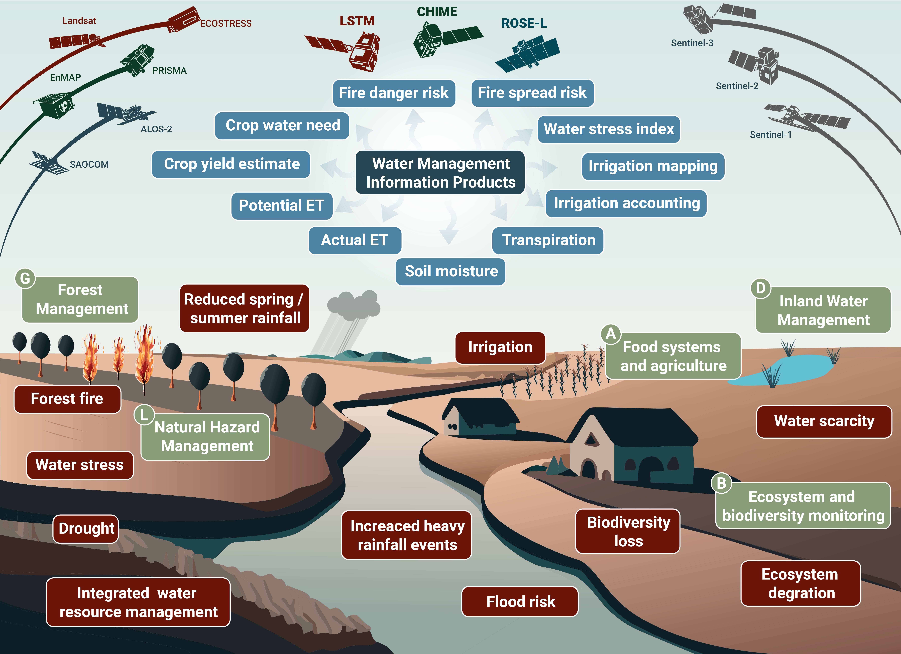

# Project overview

## Objectives and aims

The primary objective of the MULTIWATER project is to develop the necessary Representative Datasets of the Sentinel Expansion Missions and use them to implement and showcase how these datasets will provide future EO information products for specific Champion User communities. Specifically, the project aim to utilise the unique multi-sensor spatial, spectral and temporal characteristics of thermal sensors (such as ECOSTRESS or Landsat TIRS), experimental hyperspectral imagers (PRISMA, EnMAP, DESIS, and EMIT), the operational SAR sensor PALSAR-2, and operational Sentinel missions (Sentinel-1/2/3) to develop novel methods addressing the growing challenges affecting the nexus of water resource management and food security in the Mediterranean and beyond (Figure 2).

The ultimate aim of the MULTIWATER activity is to close current knowledge and information gaps on the agricultural and forest water use by making a step change toward water resource monitoring at high resolution and laying the groundwork for an operational monitoring system. The core of the MULTIWATER activity is to develop and implement a prototype for an EO-based water management information product suite at a flexible scale in the Mediterranean region. We will utilise the full potential of the enhanced observation capacity of the Expansion Missions in concert with the current Sentinel missions (supported by complementary missions and ancillary data where relevant and justified).

This product suite will consist of following data:
- **Biophysical traits** - Quantification of photosynthetic (i.e. green) and non-photosynthetic (i.e. senescent or cured) traits in sufficient quality
- **Land surface temperature (LST) and Emissivity** - in high spatial and temporal resolution 
- **Tree biomass / surface roughness** - Obtaining with high-quality estimates 
- **Top soil moisture** - Ensuring robust estimates at high spatial resolution
- **Evapotranspiration modelling (TSEB/3SEB)** - Information products with sufficient spatial resolution, frequency, coverage
  - Evaporation
  - Transpiration
  - Water stress
- **High-priority applications** - Need for relevant information products

*Conceptual illustration of water challenges in the multifunctional Mediterranean region, highlighting key challenges (red) and high-priority application selected (A, B, D, G, L, light green). Copernicus Sentinel missions (dark grey) and upcoming Expansion Missions (LSTM, CHIME and ROSE-L) provide the multi-sensor observation capacity required to advance state-of-the-art water resource management information products (light blue). Selected MULTIWATER surrogate sensors to develop Water Management Information products in preparation for Expansion Missions.*

## Background and context
The Mediterranean region, with its unique climatic conditions and diverse agricultural landscapes, faces significant challenges in managing water resources. Water scarcity, increasing demand for food production, and the impacts of climate change pose substantial obstacles to sustainable agriculture in this region [1]. The growing population and associated need for increased food production is accelerating the pressure on natural resources. Additionally, the situation is worsened by changing weather patterns due to climate change. Consequently, the demand to provide food, feed, fibre and fuel has forced farmers to intensify their production practices, while pressured to conform to the growing global demand for high-quality products that comply with health, ethical and environmental standards of sustainable and resource-efficient farming systems. Although this situation applies globally, it is particularly relevant in the Mediterranean basin, in which an increasingly heterogeneous rainfall distribution is expected with longer periods of drought and heat waves. Effective water resource management is crucial to ensure the long-term viability of agricultural activities while minimizing environmental degradation. Below listed some of the key challenges faced by agricultural landscapes in the Mediterranean region, with a particular focus on water resource management.

**Water Scarcity:** The Mediterranean region is characterized by limited water resources and irregular rainfall patterns. Water scarcity becomes a critical issue, particularly during the dry summer months when agricultural water demand is at its peak. Insufficient access to water for irrigation poses a significant challenge, as farmers must find ways to optimize water use and implement efficient irrigation techniques. 
*Project relevance: Applications A: Food systems and agriculture and D: Inland water management*

**Forest Fires:** The Mediterranean region is prone to forest fires, which are exacerbated by prolonged dry periods and high temperatures. Remote sensing can provide real-time monitoring of vegetation conditions, fuel load assessments, and fire risk mapping. This information supports the early detection of fires, fire management strategies, and post-fire recovery planning. 
*Project relevance: Applications: G: Forest Management and L: Natural Hazard Management*

**Biodiversity Loss and Ecosystem Degradation:** Climate change and other anthropogenic factors contribute to biodiversity loss and ecosystem degradation in the Mediterranean region. 
*Project relevance: Application B: Ecosystem and biodiversity monitoring*

**Integrated Water Resource Management:** To address these challenges, integrated water resource management approaches are crucial. This involves considering the entire water cycle, from rainfall to groundwater and surface water, and promoting sustainable practices such as water-efficient irrigation methods, precision agriculture, and wastewater reuse. Collaboration among stakeholders, including farmers, policymakers, and researchers, is necessary to develop and implement effective water management strategies. 
*Project relevance: Selected Champion User spanning across the Mediterranean region*

In conclusion, the agricultural landscapes of the Mediterranean region face multiple challenges related to water resource management. Water use and scarcity, climate change impacts and the need for integrated approaches are among the key issues that must be addressed. By implementing sustainable farming practices, adopting efficient irrigation techniques, and fostering collaboration, it is possible to achieve a balance between agricultural productivity and the preservation of water resources in this unique and challenging region. Technological solutions supporting informed decision-making in agriculture have expanded significantly over the last decades and this development is expected to be even more important in the coming years. However, obtaining data on crops is still a time-consuming and investment-intensive task. For this reason, it is crucial to develop systems capable of generating the necessary information in a quick and cheap way that can be accurately integrated into simple and inexpensive tools and platforms.

In reaching our goal, several international conventions and agreements can benefit from the monitoring capacity of the MULTIWATER application including: United Nations Framework Convention on Climate Change (UNFCCC) by identifying vulnerable areas that require adaptation interventions; Convention on Biological Diversity (CBD) in restoration and halting biodiversity loss in the Mediterranean region by promoting sustainable water use practises; United Nations Convention to Combat Desertification (UNCCD) in early warning systems for drought; Barcelona Convention’s Mediterranean Action Plan (MAP) by providing valuable information for ecosystem health and agricultural activities under the; Food and Agriculture Organization (FAO) International Water Management Institute (IWMI) Water Convention supporting the assessment and management of water resources in agricultural basins and more.

**MULTIWATER provides key information products for large-scale and timely management decisions in field size resolution**
