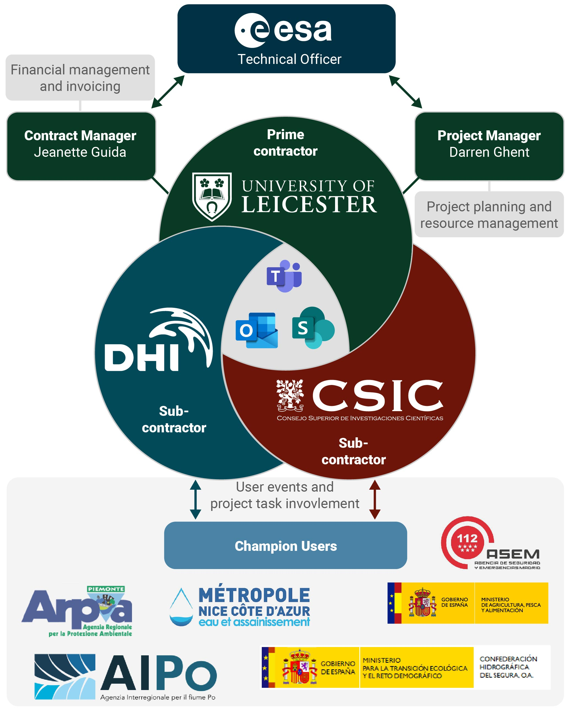
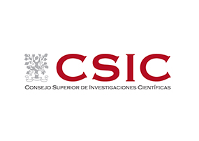
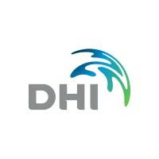
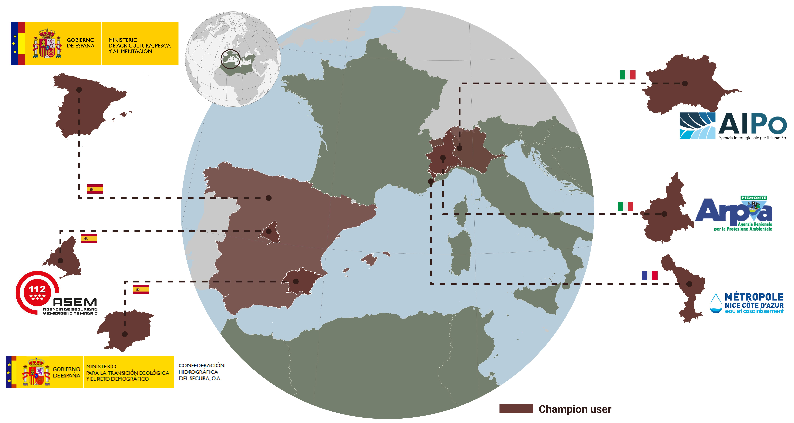

# The Team

The MULTIWATER team consists of three consortium partners, implementing the scientific and technical aspects of the project, and five champion users providing expert input and evaluation of the project's products.  

*Overall team composition, including consortium partners, ESA and Champion Users*

## Consortium partners

The consortium is built upon renowned scientific organizations in the field of water resource management and leading EO industrial partner: University of Leicester – UK (prime contractor, scientific and project lead), The Spanish State Agency of the Higher Council for Scientific Research (AECSIC) – ES (sub-contractor, scientific & methods lead), DHI – DK (sub-contractor, product generation, system implementation, promotion and outreach).

The consortium partners blend a proven track record on Earth Observation and expertise within a number of high priority applications, with the technical competences for large-scale EO-processing required to push state-of-the-art within EO based information product development, while at the same time demonstrate utility through co-development with Champion Users and ensure user uptake beyond the project span.

 **The University of Leicester (UoL)**  is one of the UK's leading research and teaching universities. The University of Leicester is, according to the Times newspaper, "An award winning institution attracting top academics". The University has 19,000 students, including 8,000 at postgraduate level. There are 34 academic departments located in five faculties: Arts, Law, Medicine and Biological Sciences, Science and Social Sciences. There is a University-wide Graduate School and an Institute of Lifelong Learning. The University employs approximately 3,500 staff.

The Earth Observation Science group is an interdisciplinary team working across the Departments of Physics/Astronomy, Chemistry and Geography. A strong component of the team, led by Prof. Hartmut Boesch, is based in the Space Research Centre of the Department of Physics and Astronomy, which houses one of the largest space research groups in Europe. The group particularly focuses on the use of Earth Observation (EO) space systems to understand regional and global causes of variability of climate, particularly in the land/ocean surface and the atmosphere; other remote sensing systems are also extensively used such as aircraft, ground-based, and ship-borne sensors. The group also hosts the Directorate and Leicester science unit of the National Centre for Earth Observation led by Prof. John Remedios. The surface temperature activities of EOS at Leicester are integrated into the NCEO Leicester science unit, benefitting from strategic support at national level. Studies of the ATSR and Sentinel-3 missions are key projects in the Leicester surface temperature team. The Leicester PI team (PI, Prof. Remedios) for ATSR has been leading the ATSR programme since 1993. The PI team has been particularly concerned to support algorithm developments, assess data quality and analyze long-term time series of sea surface temperature, and land surface temperature. ESA awarded the GlobTemperature and Climate Change Initiative Land Surface Temperature projects to a team led by Leicester (PI, Dr. Ghent). The group has been supported by ESA to develop the LST algorithms for AATSR and SLSTR on Sentinel-3, and has produced the latest LST ATBDs for these instruments. In addition, the group is responsible for the latest developments in LST cloud masking for SLSTR, with their algorithm currently being implemented into the operational chain. Through Dr Ghent the team are involved in the S3MPC and provide the SLSTR LST algorithm as well as research on cloud clearing over land. The team is also part of the GBOV (Ground-Based Observations for Validation of Copernicus Land Products). The surface temperature group has become fundamentally involved in the early specification and developments towards a potential new Copernicus mission: Land Surface Temperature Mission (LSTM) with ESA. Dr. Ghent is also a member of the MAG from LSTM.

**The Spanish State Agency of the Higher Council for Scientific Research (AECSIC)** is the largest public institution dedicated to research in Spain and the third largest in Europe. Belonging to the Spanish Ministry of Science and Innovation, its main objective is to develop and promote research that will help bring about scientific and technological progress, and it is prepared to collaborate with Spanish and foreign entities in order to achieve this aim. According to its Statute (article 4), its mission is to foster, coordinate, develop and promote scientific and technological research, of a multidisciplinary nature, in order to contribute to advancing knowledge and economic, social and cultural development, as well as to train staff and advise public and private entities on this matter.

AECSIC plays an important role in scientific and technological policy, since it encompasses an area that takes in everything from basic research to the transfer of knowledge to the productive sector. Its research is driven by its centres and institutes, which are spread across all the autonomous regions, and its more than 15,000 staff, of whom more than 3,000 are staff researchers and the same number again are doctors and scientists who are still training. AECSIC has 6% of all the staff dedicated to Research and Development in Spain, and they generate approximately 20% of all scientific production in the country. It also manages a range of important facilities; the most complete and extensive network of specialist libraries, and also has joint research units.

In order to undertake this mission, it is capacitated to carry out activities aimed at 1) The generation of knowledge through scientific and technical research 2) the transfer of research results, in particular to promote and create technology-based enterprises, 3) the provision of expert advice to public and private institutions, 4) the delivery of highly-qualified pre-doctoral and post-doctoral training, 5) the promotion of scientific culture in society, 6) The management of large facilities and unique scientific and technical infrastructures, 7) the presence and representation in international bodies, and 8) the development of targeted research.

For that reason AECSIC has participated in relevant international projects and networks related to this activities, such as the SENSECO ‘Optical synergies for spatiotemporal SENsing of Scalable ECOphysiological traits COST action, the Marie Skłodowska-Curie Innovative Training Network on Remote Sensing for Ecosystem ModElling (TruStEE), or the DATI H2020 PRIMA project on Digital Agriculture Technologies for Irrigation efficiency.

**DHI** is an independent, international consulting and research-based not-for-profit organization of more than 1100 employees, with offices in 30+ countries, project experience from more than 140 countries, and with more than 50 years of experience in water resources management and environmental sustainability. In the first part of 2021 DHI was reorganized to strengthen innovation and collaboration, to meet a new strategic focus on sustainability development and to deliver data driven advisory support in an international market. As such this activity is at the heart of our new strategy. Former DHI GRAS was incorporated into the new Earth Observation Center of Excellence (EO CoE) in which we are leveraging our strong background in remote sensing for environmental assessment and mapping and profound expertise in operational EO system and service including easy and convenient dissemination through our customized web portal development capabilities. The EO CoE section is used to adapt solutions to the specific needs of the user and the project context.

Of particular relevance for this proposal is the lead role of DHI GRAS in Sen-ET (http://esa-sen4et.org/) and ET4FAO (et4fao.dhigroup.com) projects. The objective of Sen-ET was to develop and validate methodology for combining Sentinel-3 and Sentinel-2 data to obtain high-resolution (20 m) evapotranspiration estimates. This was achieved through the use of machine-learning methods to bridge the spatial data gap between the thermal and optical Sentinel observations and to include the resulting data in a physical model of land-surface energy fluxes. In ET4FAO this method was further refined and operationalized to develop a water consumption monitoring service derived with EO observations coming purely from Copernicus satellites and delivered on multiple scales, including on local (field) scale. DHI GRAS was also leading Earth Observation for Sustainable Development activities which involved extensive consultations with International Finance Institutions and their client state partners in defining EO user needs and requirements in Africa, Asia and Latin America, and the subsequent demonstration on how agricultural EO applications based on time series of Sentinel data, can assist large International Financial Institutions (WB, IADB, ADB, IFAD, GEF etc.) and their agricultural and water resources project portfolio. Also, worth mentioning is our ongoing activity with FAO on demonstrating the utility of Sentinel-based evapotranspiration maps for consistent crop water use monitoring, from field to national scales, as preparation for future development of FAO’s WaPOR portal and involving a novel data fusion algorithm for sharpening land surface temperature measured by Sentinel-3 to Sentinel-2 scale, followed by a physically based modelling of land-surface energy fluxes.

To maintain a leading technology edge, we work with academic institutions within applied remote sensing in Denmark and elsewhere and to make sure state‑of‑the‑art knowledge is acquired. This is secured both via active presence in large scale research and development projects (H2020, Innovation Fund Denmark etc.) as well as through physical presence at the universities (guest lectures and co‑authoring of scientific papers) and through maintenance of personal relationships with university staff. Furthermore, DHI have ongoing and completed research and development projects with a broad range of clients including national agencies (e.g., ministries, coast guards, geodata agencies) to international organisations (e.g., ESA, IFIs, EU and UN) and NGOs (e.g., National Geographic, WWF) as well as private sector companies (e.g., wind companies). Finally, DnA has extensive experience in the development of Python based open source software and applications (e.g.,TigerNet, GlobWetland Africa and Sen‑ET). Common to these activities has been full release of tools and code in freely accessible online code repositories.

## Champion Users
All Champion users have been chosen to adhere to the following criteria:
- They have monitoring responsibilities with all aspects of the selected applications.
- They are Champion users of technology and data, and all experience with receiving and integrating EO-derived products.

*Overview of selected Champion Users*

**Confederación Hidrográfica del Segura (CHS)**

The Segura River Basin Authority (CHS) is a public agency ascribed to the Directorate General for Water of the Ministry for the Ecological Transition and the Demographic Challenge of Spain. CHS manages the water resources in South-Eastern Spain in order to conciliate the water rights of the users of the four autonomous communities within the basin (Murcia, Castilla-La Mancha, Comunidad Valenciana and Andalusia) with the protection of the environment. One of the main tasks of CHS is to guarantee the water supply for the agricultural sector, with a pioneering integrated water management, making the most of the available resources in terms of superficial water, transfers from external basins, groundwater, reclaimed water and desalinated sea water.
The Segura River Basin is characterized by a structural water deficit, in one of the most arid regions in Europe, as well as usual extreme meteorological events like floods and droughts. For this reason, CHS must satisfy the legal water rights while applying the EU’s Water Framework Directive principles. In addition Segura Basin is facing critical environmental issues, notably in the Mar Menor, one of the largest saltwater lagoons in Europe, with episodes of eutrophication caused, among other causes, by nitrate leaching in surrounding intensive croplands.

CHS contribution will be attending the Champion User workshops to define their needs and shape the high level products of interest. In addition, CHS will provide feedback and data for evaluating the products, such as water allocation among the different agricultural demand units, piezometric data or water flows in canals.

**Subdirección General de Cultivos Herbáceos e Industriales y Aceite de Oliva (SGCHERBA)**

The Unit of Arable and Industrial Crops and Olive Groves, dependent on the Spanish Ministry of Agriculture, Fisheries and Food, exercises the powers indicated by the Spanish Law “RD 430/2020, on 3 March 2020” in the area of cereals, oilseeds, protein products, agro-energy products, industrial products, olive oil and table olives and in the rest of extensive agricultural crops or productions. Among its competences the RD 430/2020 states that SGCHERBA will: a) develop the competences of the Department of Agriculture in matters of agricultural production, means of production and sectorial management of agricultural productions, the management and operation of agricultural markets; b) establish and develop the guidelines of the policies of management of the agricultural productions and facilities, as well as the necessary actions for the follow-up and analysis of the agricultural market; c) develop the Department's competencies in support of the economic profitability and competitiveness of farms and the management of agri-food markets, particularly through the design and implementation of CAP instruments. These include the coordination and application of the marketing standards of the agricultural sectors established in the Common Organization of Agricultural Markets (OCMA), without detriment to those that correspond to other management bodies of the Department; and d) cooperate with the autonomous communities of Spain and the most representative entities of the sector in the aforementioned matters, as well as to prepare the proposals that allow establishing the Spanish position on such matters before the European Union and other international organizations or forums, and to represent and act as interlocutor with international bodies, without detriment to the competencies of other management bodies of the Department.

Besides attending the Champion User workshops to define their needs, SGCHERBA will provide data to calibrate/validate crop yield (mainly the ESYRCE database) and feedback on the final products.

**Jefatura Del Cuerpo De Bomberos De La Comunidad De Madrid (FDO)**

The Chief Command of the Corps of Firefighters of Madrid (FDO) is part of the General Directorate of Emergencies in Madrid Region, the most densely populated region in Spain but, at the same time, with a key natural heritage with a wide range of climatic conditions and biomes, from dry and hot steppes in the Southeast to cooler deciduous and coniferous forests in the Central Ranges towards the Northwest, including the Guadarrama National Park. FDO’s responsibilities are, among others, i) the overall planning of the tasks and actions of the Fire Department of the Community of Madrid., ii) the elaboration and implementation of action plans for the prevention and extinction of fires and rescues and the performance of preventive surveillance and immediate fire extinction, iii) the prevention and extinction of forest fires., iv) the management of the Corps of Forest Rangers and the overall planning of the tasks and actions of this Corps.

FDO will actively participate in the workshops to define their needs in terms of better characterizing the ecosystems of the Community of Madrid, and the management of water and forest resources. In addition, FDO showed a large interest in monitoring grass curing for fire risk prevention, and indeed they collect in situ photographs of grass and shrub condition that will be used in MULTIWATER for cal/val activities for estimating the fraction of non-photosynthetic vegetation.

**Agenzia Interregionale per il fiume PO (AIPo)**

The Interregional Agency for the Po River (AIPo), is an organization established to manage and protect the Po River in Italy. It serves as a coordinating body between the regions surrounding the Po River basin, namely Piedmont, Lombardy, Emilia-Romagna, and Veneto. The agency's main purpose is to ensure the sustainable use of water resources, mitigate flood risks, and promote environmental conservation along the Po River and its tributaries. Through collaborative efforts, the agency strives to balance the needs of various stakeholders while safeguarding the ecological integrity and socio-economic development of the Po River basin. Its catchment covers an area of more than 74.000 square kilometres - a quarter of the national territory. It includes about 3.200 council areas and six regions: Piemonte, Valle d'Aosta, Lombardia, Veneto, Liguria, Emilia-Romagna and the Autonomous Province of Trento. The basin has a population of about 16 million and the territory is unevenly populated. The Basin is home to Italy's major industries, providing 46% of jobs, about 55% of livestock in only 5 provinces and 35% of the country's agricultural production. Divisions are defined by watershed areas and are located in four Po districts (Piedmont Po district, Lombardy Po district, Veneto Po district and Emilia- Romagna Po district). AIPo mission includes broad areas: 1) Planning, designing and building civil hydraulic projects along the Po river and its tributaries (dealing with navigation, flood control, environmental protection, disaster response, etc.) 2) river and flood forecasting, drought forecasting, planning and management of natural resources and water resource system 3) two hydraulic research laboratories are staffed with technicians from the Agency and equipped to study 3) The Flood Forecasting and River Monitoring System in the Po River provides timely and accurate river forecasts to local governments in order to reduce the vulnerability of floods and droughts in the Po Basin. 4) It is also an essential element in regional and national alert strategies.

AIPo will be attending the Champion User workshops to define relevant water resource management information products for the entire region of River Po. In addition, AIPo will engage in use case development and provide feedback and data for evaluating the products, such as water flows in the area and data on drought and flood risk.

**Agenzia Regionale per la Protezione Ambientale Piemonte (ARPA)**

The Regional Agency for Environmental Protection of Piedmont, is an organization tasked with environmental monitoring, research, and protection in the Piedmont region of Italy. ARPA Piemonte plays a crucial role in safeguarding the environment, promoting sustainable development, and ensuring public health and safety. The agency conducts scientific studies, collects data, and assesses various aspects of the environment, including air quality, water resources, soil contamination, and waste management. Through its activities, ARPA Piemonte aims to provide reliable information, support policy-making processes, and implement measures to preserve and improve the environmental quality of the Piedmont region.

ARPA will contribute to the requirement consolidation especially for soil moisture and fire risk danger during the Champion User workshops. Additionally, they will provide valuable information for product validation and setting up relevant use cases for any potential future operational system for water resource availability.

**Régie Eau-Azur, Nice**

Régie Eau-Azur is a water utility company based in the region of Azur in France. The company is responsible for managing and providing water services to the residents and businesses within its jurisdiction. Régie Eau-Azur focuses on ensuring the reliable supply of clean and safe drinking water, as well as the proper treatment and disposal of wastewater. Régie Eau-Azur is dedicated to delivering high-quality water services, promoting water conservation practices, and protecting the environment through responsible water management. Its primary goal is to ensure the availability of essential water resources while maintaining the health and well-being of the population and the sustainability of the region's water infrastructure. By maintaining proper water supply and distribution networks, the company helps ensure that firefighting efforts have access to sufficient water resources in case of emergencies, potentially reducing the risk and impact of fires. Adequate water supply is essential for crop growth and development, ultimately influencing crop yield and productivity.

